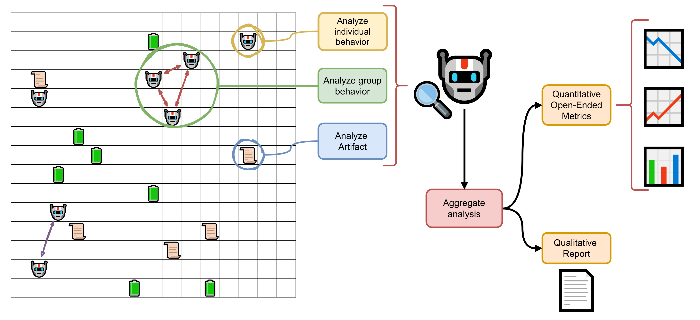

# TerraLingua

**Paper:** [Link](https://www.researchgate.net/publication/402263491_TerraLingua_Emergence_and_Analysis_of_Open-endedness_in_LLM_Ecologies) - [ArXiv](https://arxiv.org/abs/2603.16910)

**Dataset:** https://huggingface.co/datasets/GPaolo/TerraLingua

**Dataset dashboard:** https://aianthropology.decisionai.ml/


A multi-agent simulation framework for studying emergent behavior, artifact creation, and cultural evolution.

LLM-powered agents (Claude or other models) interact in a shared 2D grid environment — foraging for resources, creating text artifacts, reproducing, and communicating — enabling research into how language-using agents develop social structure and culture over time.

After each experiment, the **AI Anthropologist** — itself an LLM agent — analyzes the simulation logs to annotate agent behaviors, infer group dynamics, classify artifacts, and trace cultural lineages, providing a qualitative and quantitative account of what emerged.

An overview of the TerraLingua system and of the AI-Anthropologist is shown in the figure below.




## Installation

Requires **Python 3.13+**.

**Using venv:**

```bash
python -m venv .venv
source .venv/bin/activate
pip install -r requirements.txt
```

**Using conda:**

```bash
conda create -n terralinguia python=3.13
conda activate terralinguia
pip install -r requirements.txt
```

Copy `.env.example` to `.env` and fill in your API key(s):

```bash
cp .env.example .env
```

## Running Experiments

Run directly with `main.py` using CLI flags:

```bash
python main.py --exp_name my_experiment --init_agents 10 --max_ts 200 --model claude-haiku-4-5
```

Or use `run_experiment.sh`, a fully annotated template with all available options documented:

```bash
bash run_experiment.sh
```

Logs are written to `logs/<exp_name>/`.

### Reproducing paper experiments

The `paper_experiment_scripts/` folder contains the exact scripts used to run each experiment from the paper. All scripts must be run from the project root:

```bash
bash paper_experiment_scripts/run_core.sh
```

## Supported Agent Models

Pass any of the following keys via `--model`:

| Key | Provider | Notes |
|---|---|---|
| `claude-haiku-4-5` | Anthropic | Fast, cost-effective |
| `claude-sonnet-4-6` | Anthropic | Default |
| `o4-mini` | OpenAI | |
| `o3-mini` | OpenAI | |
| `gpt-5.1` | OpenAI | |
| `gpt-5-mini` | OpenAI | |
| `QWEN2.5` | Local (vLLM) | Qwen2.5-32B-Instruct |
| `QWEN3` | Local (vLLM) | Qwen3-32B |
| `DeepSeek-R1-32` | Local (vLLM) | DeepSeek-R1-Distill-Qwen-32B |
| `DeepSeek-R1-70` | Local (vLLM) | DeepSeek-R1-Distill-Llama-70B |

### Local models (vLLM)

Local models require a running [vLLM](https://github.com/vllm-project/vllm) server. Start one (or more) on any of the default ports (`9000–9003`, `9010–9012`):

```bash
vllm serve Qwen/Qwen3-32B --port 9000
```

Then pass the ports via `--ports` (defaults to `9000 9001 9002 9003 9010 9011 9012`):

```bash
python main.py --model QWEN3 --ports 9000 9001
```

TerraLingua will auto-discover which ports are hosting the requested model and load-balance across them.

## Data Analysis

Analysis is performed by the **AI Anthropologist**, a post-hoc LLM-based framework that annotates agent behaviors, infers group dynamics, classifies artifacts, and traces cultural lineages. See [`analysis_scripts/AI_ANTHROPOLOGIST.md`](analysis_scripts/AI_ANTHROPOLOGIST.md) for a detailed description of the pipeline.

Scripts follow a numbered order and must be run from the **project root** (they import from `core` and `analysis_scripts` as packages):

| Script | Description |
|---|---|
| `001_llm_agent_analyser.py` | Annotate agent logs with LLM-generated behavior labels |
| `002_make_graph.py` | Build interaction graphs and compute network metrics |
| `003_llm_group_analyser.py` | Group-level behavioral analysis |
| `004_artifact_analysis.py` | Compute artifact complexity metrics |
| `005_artifact_classification.py` | Classify artifacts into behavioral categories |
| `006_artifact_philogeny.py` | Analyze artifact genealogy and conceptual ancestry |

```bash
python analysis_scripts/001_llm_agent_analyser.py
```

## Data Visualization

Notebooks in `analysis_scripts/notebooks/` mirror the analysis pipeline:

| Notebook | Description |
|---|---|
| `n000_general_stats.ipynb` | Overall experiment statistics |
| `n001_llm_agent_analyser.ipynb` | Per-agent behavior visualization |
| `n002_graph_analysis.ipynb` | Interaction network plots |
| `n003_llm_group_analysis.ipynb` | Group dynamics |
| `n004_artifact_analysis.ipynb` | Artifact complexity over time |
| `n005_artifact_categories.ipynb` | Classification results |
| `n006_artifact_phylogeny.ipynb` | Artifact lineage trees |
| `n007_interactive_phylogeny.ipynb` | Interactive phylogeny explorer |

```bash
jupyter notebook analysis_scripts/notebooks/
```

## Citation

If you use TerraLingua in your research, please cite:

```bibtex
@techreport{paolo26terralingua,
title = "TerraLingua: Emergence and Analysis of Open-Endedness in LLM Ecologies",
author = "Giuseppe Paolo and Jamieson Warner and Hormoz Shahrzad and Babak Hodjat and Risto Miikkulainen and Elliot Meyerson",
year = 2026,
month = jan,
institution = "Cognizant AI Lab",
url = "https://www.researchgate.net/publication/402263491_TerraLingua_Emergence_and_Analysis_of_Open-endedness_in_LLM_Ecologies",
doi = "10.13140/RG.2.2.25551.55206",
number = "2026-01",
}
```
